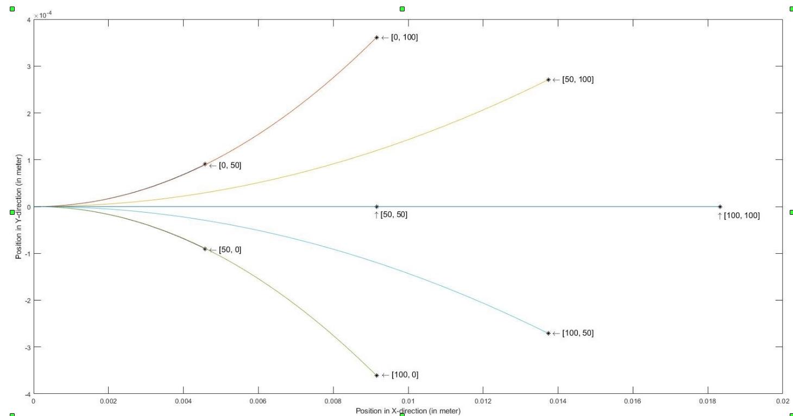

# Implementation of A* algorithm on a differential drive (non-holonomic) robot
</a>

## Overview
A simple walker algorithm, like roomba, implemented on turtlebot. The aim is to navigate a differential drive robot (TurtleBot 2 / TurtleBot 3) in a Robotics Realization Lab’s virtual environment from a given start point to a given goal point. Considering differential drive constraints while implementing the A* algorithm, with 8-connected action space.

A non-holonomic robot is the one that cant move in y-direction independently. We have to define smooth moves for the robot by providing the left and right wheel velocities.The time for each move has to be fixed, and the time for each move defines resolution

## RRL map


## Non Holomic constraints


## Dependencies
The following dependencies are required to run this package:

- ROS kinetic
- catkin
- Ubuntu 16.04
- Turtlebot packages
For installing ROS, follow the process given [here](http://wiki.ros.org/kinetic/Installation)

For installing catkin, follow the process given [here](http://wiki.ros.org/catkin#Installing_catkin)

For installing turtlebot packages, in a new terminal enter the following command:
```
sudo apt-get install ros-kinetic-turtlebot-*
```
This will install the turtlebot packages.

**Note:** catkin is usually installed by default when ROS is installed.

## Building the package
To build this package follow the steps below:
```
source /opt/ros/kinetic/setup.bash
mkdir -p ~/catkin_ws/src
cd ~/catkin_ws/src
git clone --recursive https://github.com/adityavaishampayan/ENPM_661_proj3.git

chmod +x final_submit.py
catkin_make
source devel/setup.bash
```
## Running the demo
Once the build is complete successfully, you can run it using roslaunch:
```
export TURTLEBOT3_MODEL=waffle
roslaunch astar_differential astar.launch x_pos:=0.0 y_pos:=0.0
```
 (Here x and y are in gazebo coordinate frame) I.e. if start coordinates  in generated map is at (955, 505) , we spawn the robot at x_pos:= 4.0 and y_pos:=0.0
 This will start the gazebo simulation with the turtlebot in it as well as the node.


## Recording bag files
To enable recording of all topics, you can use the argument `record:=true`(By default it is set as false).
```
roslaunch astar_differential astar.launch x_pos:=0.0 y_pos:=0.0
record:=true
```
You can also specify the time for which you want to record the bag file using:
```
roslaunch astar_differential astar.launch x_pos:=0.0 y_pos:=0.0
 record:=true record_time:=30
```
This will record the bag file for 30s and save it in the results subdirectory.

To examine the recorded bag file, use:
```
rosbag info results/turtlebot_walker.bag
```
## Playing the bag file
To inspect the recorded bag file, go to the results subdirectory and enter:
```
rosbag info turtlebot_walker.bag
```
This will give the information about all the topics recorded and duration of recording of the bag file. To play the bag file use:
```
rosbag play turtlebot_walker.bag
```
Now, you can view the recorded messages being published on the topic `/mobile_base/commands/velocity` as:
```
rostopic echo /mobile_base/commands/velocity
```
